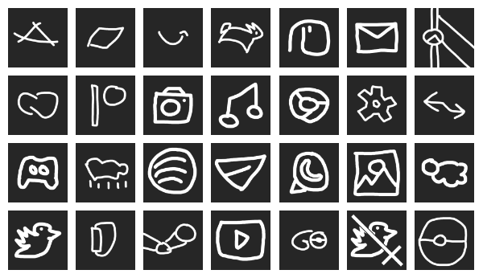

# ios-icons

A Small repository to store iOS shortcut icons I use!

## How to use
1. Download the icon you want to use
2. Open the Shortcuts app
3. Create a new shortcut
4. Add the action "Open App"
5. Select the app you want to open
6. Tap the three dots in the top right corner
7. Tap "Add to Home Screen"
8. Tap the icon in the top left corner
9. Select "Choose File"
10. Select the icon you downloaded
11. Tap "Add"
12. Tap "Add" again
13. Name your shortcut
14. Tap "Add"
15. Done!